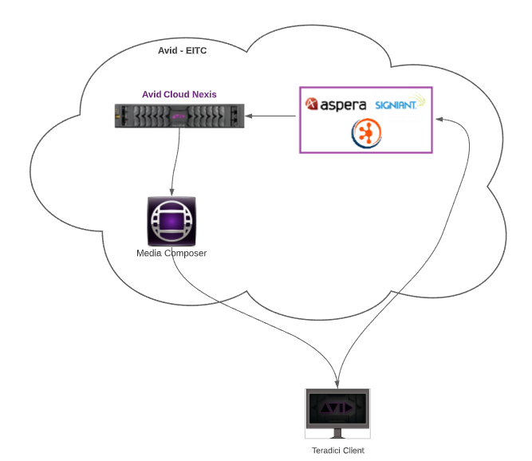

# Abstract

This readme file explains the value of video editorial in the cloud using Avid Media Composer and Avid Nexis on Microsoft Azure and summarizes key resources in this repository: a deployment guide and deployment scripts. The deployment guide included in this repository explains, step-by-step, how to deploy these applications into your Azure subscription.  The deployment guide and accompanying scripts are designed for media production companies that want to provide an edit-on-demand deployment experience.

# Deployment Architecture 

# Prerequisite

- Showcode: 3 to 4 letters
- Active enterprise or pay-as-you-go Azure subscription
- License for: a) Avid NEXIS | Cloud, b) Avid Media Composer | Ultimate with VM Option, c) Signiant MediaShuttle / Aspera HSTS / FileCatalyst Server, d) Teradici Graphics Agent 

# Deploy to Azure

To perform a successful deployment in your subscription, follow the steps below: 

1) Deploy each module needed either via Azure Portal or Azure cli. 

2) Follow the deployment guide to finish each module configuration.  

## Module deployment

There are two ways to deploy Avid EITC module via ARM template: 

a) Using Azure Portal

Follow the guide below to copy the ARM templates to your Azure subscription:

[Az Portal deployment](https://github.com/avid-technology/VideoEditorialInTheCloud/tree/master/Avid_Edit_In_The_Cloud_Arm/Document/AzPortalGuide.pdf) 

b) Using Az cli

Follow the guide below to deploy each module directly from CLI:

[Az Cli deployment](https://github.com/avid-technology/VideoEditorialInTheCloud/tree/master/Avid_Edit_In_The_Cloud_Arm/Document/AzCliGuide.pdf) 

## Module configuration

Once you are done with each module deployment, finish the installation using the deployment guide: 

[Az Cli deployment](https://github.com/avid-technology/VideoEditorialInTheCloud/blob/master/Avid_Edit_In_The_Cloud_Arm/Document/Deployment_Guide_2020.pdf) 