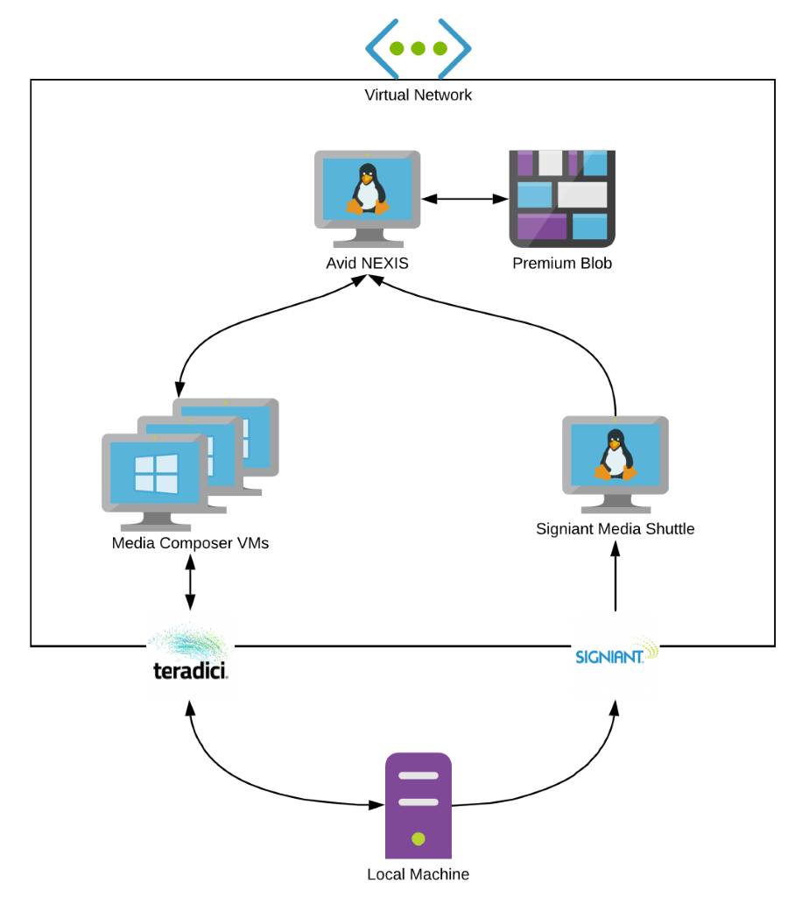

# Abstract

This readme file explains the value of video editorial in the cloud using Avid Media Composer and Avid Nexis on Microsoft Azure and summarizes key resources in this repository: a deployment guide and deployment scripts. The deployment guide included in this repository explains, step-by-step, how to deploy these applications into your Azure subscription.  The deployment guide and accompanying scripts are designed for media production companies that want to provide an edit-on-demand deployment experience.

# Summary

The cloud will transform how creatives in the Media and Entertainment Industry produce content and collaborate across teams and geographies.  Despite the dramatic potential of the cloud to transform the industry, many creative individuals, teams and companies are not sure how or where to begin their cloud journey.  Microsoft and Avid Technologies have worked jointly on many cloud editorial projects and projects enabling major media companies to migrate their video production workflows to Azure.  We have found the most empowering approach is to learn by doing, ie. Just start experimenting, hands-on, with how Avid on Azure enables cloud-based content production.

The deployment guide and accompanying scripts in this repository enable that hands-on experimentation.  The deployment guide provides step-by-step guidance for installing and configuring a proof of concept environment for you and or your team to immediately deploy and use Avid’s industry leading products – Media Composer and Nexis – for content editing on the Azure Cloud.

# Capabilities of this Solution

Once you have deployed this solution you can

Upload video content to Nexis on Azure

Edit video content using Media Composer on Azure

Back up your video content to Nexis on Azure.

# What is Deployed as part of this Solution

# Deploy to Azure
 

Clone project to your local repository

<b> 1) [for new environment] Create Resource Group within your subscription: </b>
 

PS> az login

PS> az group create --location xxxx --name xxxx

<i>Example: ps> az group create --location "westus2" --name "myresourcegroup"</i>

<b> 2) [for new environment] Create Vnet within your Resource Group: </b>
 

PS> az network vnet create --name xxx --resource-group xxx --address-prefix x.x.x.x/xx --subnet-name xxx --subnet-prefix x.x.x.x/xx

<i>Example: ps> az network vnet create --name "myvnet" --resource-group "myresourcegroup" --address-prefix 10.0.0.0/16 --subnet-name "mysubnet1" --subnet-prefix 10.0.0.0/24</i>

<b> 3) Choose a file transfer accelerator module: </b>
 

| Module | Supported Version | Code |
| ------ | ------------------ | ----------------- |
| Signiant | - Signiant SDCX Server v3.3.2   - Avid NEXIS Client v2020.7.3 | az deployment group create --name xxx --resource-group xxxx --template-file ".\signiant\signiantazuredeploy.json" --parameters xxxx  |
| FileCatalyst | - FileCatalyst v3.8.1   - Avid NEXIS Client v2020.7.3 | az deployment group create --name xxx --resource-group xxxx --template-file ".\filecatalyst\filecatalystazuredeploy.json" --parameters xxxx |
| Aspera | - Aspera HSTS v3.9.6 - Avid NEXIS Client v2020.7.3 | (Coming soon) |

<i>Example: ps> az deployment group create --name "SigniantTestDeployment" --resource-group "myresourcegroup" --template-file ".\signiant\signiantazuredeploy.json" --parameters ".\signiant\signiant.parameters.json"</i>

<i>Example: ps> az deployment group create --name "FileCatalystTestDeployment" --resource-group "myresourcegroup" --template-file ".\filecatalyst\filecatalystazuredeploy.json" --parameters ".\filecatalyst\filecatalyst.parameters.json"</i>

<i>Example: ps> az deployment group create --name "AsperaTestDeployment" --resource-group "myresourcegroup" --template-file ".\aspera\asperaazuredeploy.json" --parameters ".\aspera\aspera.parameters.json"</i>

<b> 4) Choose a Media Composer module depending on the version and GPU selected. </b>
 

| Module | Supported Version | Code |
| ------ | ------------------ | ----------------- |
| Media Composer 2018.12.11 / 2019.12 / 2020.4 (Nvidia) | - Media_Composer_2018.12.11_Win.zip, Media_Composer_2019.12_Win.zip, Media_Composer_2020.4._Win.zip   - pcoip-agent-graphics_20.04.0.exe   - 442.06_grid_win10_64bit_international_whql.exe   - AvidNEXISClient_Win64_20.3.1.14.msi | az deployment group create --name xxx --resource-group xxxx --template-file ".\mediacomposer\mediacomposerazuredeploy_NVIDIA.json" --parameters xxxx  |
| Media Composer 2018.12.11 / 2019.12 / 2020.4 (AMD) | - Media_Composer_2018.12.11_Win.zip, Media_Composer_2019.12_Win.zip, Media_Composer_2020.4._Win.zip   - pcoip-agent-graphics_20.04.0.exe   - Radeon-Pro-Software-for-Enterprise-GA.exe   - AvidNEXISClient_Win64_20.3.1.14.msi | az deployment group create --name xxx --resource-group xxxx --template-file ".\mediacomposer\mediacomposerazuredeploy_AMD.json" --parameters xxxx |

To duplicate the VM, follow the steps below:

a) Create a snapshot of the main os disk.  

b) Run script to duplicate snapshot x time (right click / run in powershell connected to your azure subscription).  

[snapshot script](scripts/create_disk_from_snapshot.ps1)

c) Use duplication ARM template: 

 

5) Deploy a Nexis storage module.

 

| Module | Compatible Version | ARM Template link |
| ------ | ------------------ | ----------------- |
| Nexis 20.3.2 | AvidNexisCloud_20.3.2-17.run |  |

 