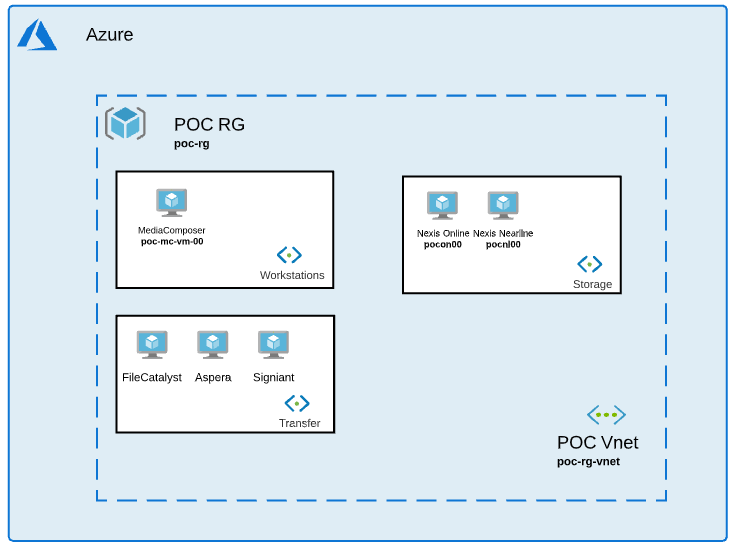

# Abstract

This readme file explains the value of video editorial in the cloud using Avid Media Composer and Avid Nexis on Microsoft Azure. The deployment guide included in this repository explains, step-by-step, how to deploy these applications into your Azure subscription.  The deployment guide and accompanying scripts are designed for media production companies that want to provide an edit-on-demand deployment experience.

# Deployment Architecture 

# Prerequisite

- Resource Prefix: 3 to 4 letters.

- Active enterprise or pay-as-you-go Azure subscription.

- License for: a) Avid NEXIS | Cloud, b) Avid Media Composer Ultimate with VM Option, c) Signiant MediaShuttle, Aspera HSTS, FileCatalyst Server, d) Teradici Graphics Agent.

# Deploy to Azure

To perform a successful deployment in your subscription, follow the steps below: 

1) Deploy each module needed. 

2) Follow the deployment guide to finish each module configuration.  

## Module deployment

1) [Optional] Create Resource Group within your subscription directly within Azure Portal.

 

2) [Optional] If you don’t have a Vnet yet, create one Vnet (with at least one subnet) directly within Azure Portal using the link below:

 

| Module | Compatible Version | ARM Template link |
| ------ | ------------------ | ----------------- |
| Vnet | n/a |  |

 

3) Choose a file transfer accelerator module: Signiant, FileCatalyst or Aspera

 

| Module | Compatible Version | ARM Template link |
| ------ | ------------------ | ----------------- |
| Signiant | Signiant 3.3.2   Nexis 20.7.3.10 (Client) |  |
| FileCatalyst | FileCatalyst 3.7.3b38   Nexis 20.7.3.10 (Client) |  |
| Aspera | Aspera 3.9.6   Nexis 20.7.3.10 (Client) |  |

 

4) Choose a Media Composer module depending on the version and GPU selected.

 

| Module | Compatible Version | ARM Template link |
| ------ | ------------------ | ----------------- |
| Media Composer | Media Composer 2018.12.13  / 2019.12 / 2020.9.0   Nexis 20.7.3.10 (Client)   Teradici Agent 20.10.1   Amd GPU   Nvidia GPU |  |

 

To duplicate the VM, follow the steps below:
 

a) Create a snapshot of the main os disk
 

b) Run script to duplicate snapshot x time (right click / run in powershell connected to your azure subscription)
 

c) Use duplication ARM template: 
 

 

5) Deploy a Nexis storage module.

 

| Module | Compatible Version | ARM Template link |
| ------ | ------------------ | ----------------- |
| Nexis | Avid Cloud Nexis 20.7.0 |  |

 

## Module configuration

Once you are done with each module deployment, finish the installation using the deployment guide: 

[Az Cli deployment](https://github.com/avid-technology/VideoEditorialInTheCloud/blob/master/Avid_Edit_In_The_Cloud_Arm/Document/Deployment_Guide_2020.pdf) 