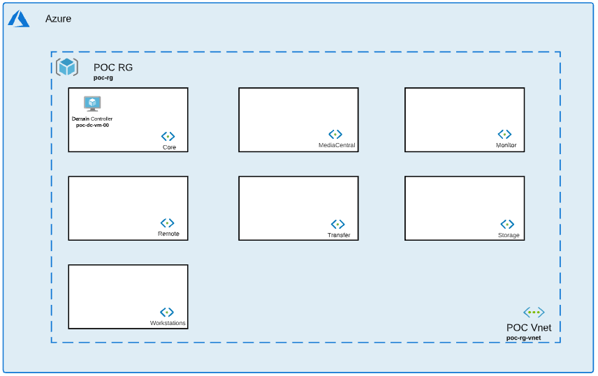

# Core Collection

## Introduction

This collection will help you deploy 1 resource group and 1 domain controller. 

A basic network will be built in the resource group with 1 Vnet and 7 subnets corresponding to each collection: 

- subnet_core
- subnet_mediacentral
- subnet_monitor
- subnet_remote
- subnet_storage
- subnet_transfer
- subnet_workstations

2 default NSG will be created: 

- nsg-remote
- nsg_default

To promote the server to be a domain controller, follow the link below: 

- Promote server to [Domain Controller](https://computingforgeeks.com/how-to-install-active-directory-domain-services-in-windows-server/)

## Installation 

1. Navigate to Core collection: *$cd Avid_Edit_In_The_Cloud_Terraform/Core/*
1. Initialize terraform: *$terraform init*
1. Apply configuration: *$terraform apply*
1. Navigate to each other collection and add resource as needed (MediaCentral, Transfer, Workstations, Remote etc ...)

## Variables

### Network Module

- **resource_group_name** (string): Resource Group Name where all resources will be built.
- **resource_group_location** (string): Region where all resources will be built. 
- **vnet_name** (string): Vnet name where all resources will be built. 
- **address_space** (list): Main Vnet address CIDR.
- **subnets** (map): Subnet addresses CIDR. Keep empty quote if subnet is not needed. 
- **dns_servers** (list): IP address(es) of DNS server(s), Vnet will be pointing to. Keep empty to use Azure provided DNS (168.63.129.16). 
- **create_subnet_Mediacentral** (bool): Create or not a subnet for MediaCentral collection.
- **create_subnet_Monitor** (bool): Create or not a subnet for Monitor collection.
- **create_subnet_Remote** (bool): Create or not a subnet for Remote collection.
- **create_subnet_Storage** (bool): Create or not a subnet for Storage collection.
- **create_subnet_Transfer** (bool): Create or not a subnet for Transfer collection.
- **create_subnet_Workstations** (bool): Create or not a subnet for Workstations collection.                 
- **tags** (map): Tag for Resource Group. 

### Domain Controller Module

- **local_admin_username** (string): Username for local administrator.              
- **local_admin_password** (string): Local administrator password.             
- **resource_group_name** (string): Resource Group Name.            
- **resource_group_location** (string): Region where all resources will be built.          
- **vnet_name** (string): Vnet name where all resources will be built.                       
- **subnet_name** (string): Subnet name where all resources will be built.                     
- **script_url** (string): Location of extension script to be called by VM. Public EITC Github by default.                   
- **installers_url** (string): Location of all installers.              
- **domaincontroller_vm_size** (string): Size of Domain Controller VM.        
- **domaincontroller_vm_hostname** (string): Name of Domain Controller.    
- **domaincontroller_nb_instances** (number): Number of Domain Controller server(s) needed. 
- **domaincontroller_internet_access** (bool): Internet access to Domain Controller. *False* recommended for better security. 