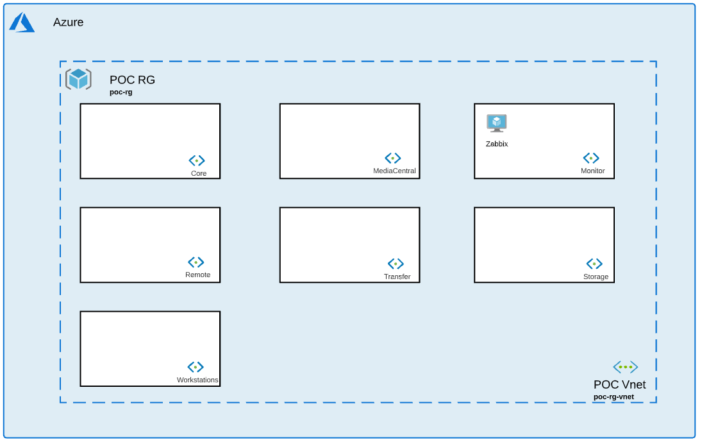

# Monitor Collection

## Introduction

This collection will help you deploy one Zabbix server to monitor your environment.  

## Installation 

1. Navigate to Monitor collection: *$cd Avid_Edit_In_The_Cloud_Terraform/Monitor/*
1. Initialize terraform: *$terraform init*
1. Apply configuration: *$terraform apply*

## Variables

### Monitor Module

- **local_admin_username** (string): Username for local administrator.              
- **local_admin_password** (string): Local administrator password.
- **resource_group_name** (string): Resource Group Name where all resources will be built.
- **resource_group_location** (string): Region where all resources will be built. 
- **vnet_name** (string): Vnet name where all resources will be built. 
- **subnet_name** (string): Subnet name where all resources will be built. 
- **script_url** (string): Location of extension script to be called by VM. Public EITC Github by default.                   
- **installers_url** (string): Location of all installers.
- **zabbix_vm_hostname** (string): Name of Zabbix.
- **zabbix_vm_size** (string): Size of Zabbix VM.        
- **zabbix_nb_instances** (number): Number of Zabbix needed. 
- **zabbix_internet_access** (bool): Internet access to Zabbix. *False* recommended for better security.