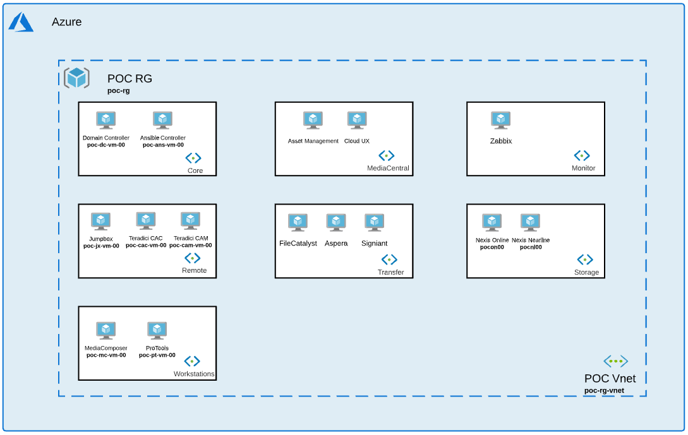

# Editorial In The Cloud - Terraform

## Introduction

This repository demonstrates how to deploy an *Editorial In The Cloud* environment based on Avid technology and partners via Terraform. This is a Proof of Concept based on a specific network. You will certainly have a different network architecture and should adapt each module to your specific environment. 

Avid will not be accountable for environment taken to production based on this repository. You should work with your own security team to make sure all module deployed follows your specific network rules and best practice. 

 Modules are grouped together by collection: 

- **Core**: Resource Group,Network, Domain Controller.
- **Mediacentral**: Asset Management, Cloud UX.
- **Monitor**: Zabbix.
- **Remote**: Jumpbox, Teradici CAC.
- **Transfer**: FileCatalyst, Aspera, Signiant.
- **Storage**: Nexis.
- **Workstations**: MediaComposer, ProTools.

Each module contains a readme documentation to explain what the collection can build.

For the proof of concept, we will deploy the following network: 

## Prerequisite

There is a dockerfile at the repository root to help you run this code in a container. This solution has been tested with Docker version 20.10.5. 

If you decide to not run this code in a container, make sure you have the following tool and version: 

- Terraform >= 0.14.4
- Azure CLI >= 2.17.1
- Ansible >= 2.9.6
- Packer >= 1.6.6
- Azurerm >= 2.26

## Installation 

1. Clone entire repository.
1. Navigate to Core collection. Use Terraform apply to deploy 1 Resource Group with 1 vnet, 7 subnets and 1 Domain Controller.
1. Navigate to each other collection and add resource as needed (MediaCentral, Transfer, Workstations, Remote etc ...)  

## Additional documentaiton

- Introduction to Terraform on Azure: [Terraform](https://learn.hashicorp.com/tutorials/terraform/infrastructure-as-code?in=terraform/aws-get-started)

## Maintainer

For any information or to report bug and security issue, feel free to contact benjamin.ghis@avid.com 

