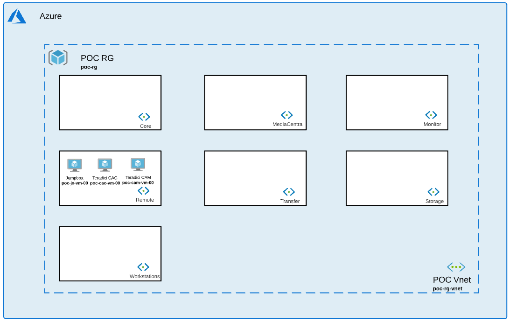

# Remote Collection

## Introduction

This collection will help you deploy 1 Jumpbox and 1 Teradici CAC server. 

Jumpbox will help you create a single point of access to your resource group. You should modify the NSG handling remote connections to only allow specific IP addresses to access your resources.

Teradici CAC server is a solution built by Teradici to access VM via PCoIP protocol. Find more information at [Teradici CAC](https://docs.teradici.com/find/product/cloud-access-software/current?subscriptionName=cloud-access)

## Installation 

1. Navigate to Remote collection: *$cd Avid_Edit_In_The_Cloud_Terraform/Remote/*
1. Initialize terraform: *$terraform init*
1. Apply configuration: *$terraform apply*
1. Go to Storage collection [Reame](https://github.com/avid-technology/VideoEditorialInTheCloud/tree/master/Avid_Edit_In_The_Cloud_Terraform/Storage) to install your next collection. 

## Variables

### Jumpbox Module

- **local_admin_username** (string): Username for local administrator.              
- **local_admin_password** (string): Local administrator password.
- **domain_admin_username** (string): Username for domain administrator.              
- **domain_admin_password** (string): Domain administrator password.
- **domainName** (string): Name of domain to join.
- **resource_group_name** (string): Resource Group Name where all resources will be built.
- **resource_group_location** (string): Region where all resources will be built. 
- **vnet_name** (string): Vnet name where all resources will be built. 
- **subnet_name** (string): Subnet name where all resources will be built. 
- **script_url** (string): Location of extension script to be called by VM. Public EITC Github by default.                   
- **installers_url** (string): Location of all installers.
- **jumpbox_vm_hostname** (string): Name of Jumpbox.
- **jumpbox_vm_size** (string): Size of Jumpbox VM.        
- **jumpbox_nb_instances** (number): Number of Jumpbox needed. 
- **jumpboxScript** (string): Script extension to call at the end of terraform deployment. 
- **jumpbox_internet_access** (bool): Internet access to Jumbpox. *False* recommended for better security.

### Teradici cac Module

- **local_admin_username** (string): Username for local administrator.              
- **local_admin_password** (string): Local administrator password.             
- **resource_group_name** (string): Resource Group Name.            
- **resource_group_location** (string): Region where all resources will be built.          
- **vnet_name** (string): Vnet name where all resources will be built.                       
- **subnet_name** (string): Subnet name where all resources will be built.                     
- **script_url** (string): Location of extension script to be called by VM. Public EITC Github by default.                   
- **installers_url** (string): Location of all installers.              
- **teradicicac_vm_size** (string): Size of Teradici CAC VM.        
- **teradicicac_vm_hostname** (string): Name of  Teradici CAC.    
- **teradicicac_nb_instances** (number): Number of  Teradici CAC server(s) needed. 
- **teradicicacScript** (string): Script extension to call at the end of terraform deployment.
- **teradicicac_internet_access** (bool): Internet access to  Teradici CAC. *False* recommended for better security. 
