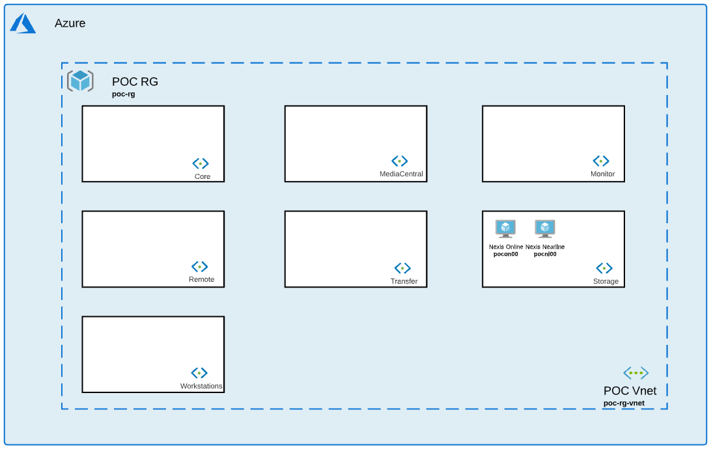

# Storage Collection

## Introduction

This collection will help you deploy an Online and Nearline Cloud Nexis. 

## Installation 

1. Navigate to Storage collection: *$cd Avid_Edit_In_The_Cloud_Terraform/Storage/*
1. Initialize terraform: *$terraform init*
1. Apply configuration: *$terraform apply*
1. Go to Workstations collection [Reame](https://github.com/avid-technology/VideoEditorialInTheCloud/tree/master/Avid_Edit_In_The_Cloud_Terraform/Workstations) to install your next collection. 

## Variables

### Nexis Module

- **hostname** (string): Nexis hostname. Maximum of 6 characters with no special character (ex: pocon).
- **local_admin_username** (string): Username for local administrator.              
- **local_admin_password** (string): Local administrator password.
- **resource_group_name** (string): Resource Group Name where all resources will be built.
- **resource_group_location** (string): Region where all resources will be built.
- **vnet_name** (string): Vnet name where all resources will be built. 
- **subnet_name** (string): Subnet name where all resources will be built. 
- **nexis_storage_account_public_access** (bool): internet access to Azure storage account.
- **nexis_system_director_vm_size** (string): Size of Nexis system director.
- **nexis_system_director_nb_instances** (number): Number of Nexis system director to deploy.
- **nexis_system_director_vm_script_url** (string): Location of extension script to be called by VM. Public EITC Github by default.
- **nexis_system_director_vm_script_name** (string): Script name to launch to install Nexis software.
- **nexis_system_director_vm_artifacts_location** (string): Location of all installers.
- **nexis_system_director_vm_build** (string): Nexis software image.
- **nexis_system_director_vm_part_number** (string): Nexis part number (depends on online or nearline Nexis). 
- **nexis_system_director_performance** (string): Storage account performance (depends on online or nearline Nexis). 
- **nexis_system_director_replication** (string): Storage account replication (depends on online or nearline Nexis).
- **nexis_system_director_account_kind** (string): Storage account kind (depends on online or nearline Nexis).
- **nexis_system_director_internet_access** (bool): Internet access for system director.
- **nexis_system_director_image_reference** (string): System Director VM image. Either Debian 8 or 10.
