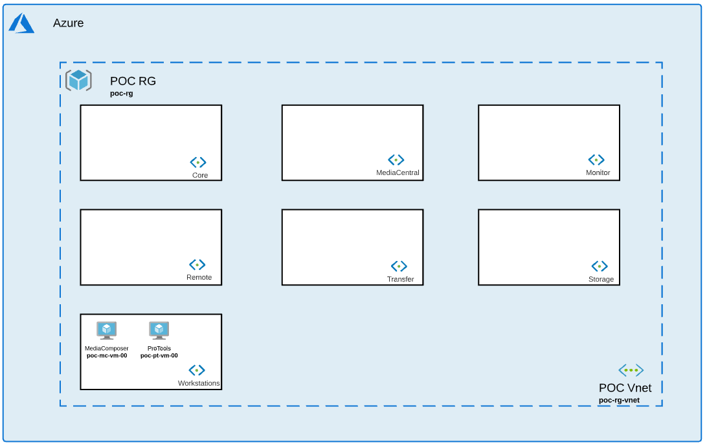

# Workstations Collection

## Introduction

This collection will help you deploy 1 (or more) MediaComposer and 1 (or more) ProTools instance.  

## Prerequisite

- MediaComposer and/or ProTools license(s)

## Installation 

1. Navigate to Workstations collection: *$cd Avid_Edit_In_The_Cloud_Terraform/Workstations/*
1. Initialize terraform: *$terraform init*
1. Apply configuration: *$terraform apply*
1. Go to Transfer collection [Reame](https://github.com/avid-technology/VideoEditorialInTheCloud/tree/master/Avid_Edit_In_The_Cloud_Terraform/Workstations) to install your next collection. 

## Variables

### MediaComposer Module

- **local_admin_username** (string): Username for local administrator.              
- **local_admin_password** (string): Local administrator password.
- **domain_admin_username** (string): Username for domain administrator.              
- **domain_admin_password** (string): Domain administrator password.
- **domainName** (string): Name of domain to join.
- **script_url** (string): Location of extension script to be called by VM. Public EITC Github by default.                   
- **installers_url** (string): Location of all installers.
- **resource_group_name** (string): Resource Group Name where all resources will be built.
- **resource_group_location** (string): Region where all resources will be built.
- **vnet_name** (string): Vnet name where all resources will be built. 
- **subnet_name** (string): Subnet name where all resources will be built. 
- **gpu_type** (string): Type of GPU. Either Nvidia or Amd.
- **mediacomposer_vm_hostname** (string): MediaComposer hostname.
- **mediacomposer_vm_size** (string): Size of MediaComposer VM.        
- **mediacomposer_nb_instances** (number): Number of MediaComposer needed. 
- **mediacomposer_internet_access** (bool): Internet access to MediaComposer. 
- **mediacomposerScript** (string): Script extension to call at the end of terraform deployment. 
- **mediacomposerVersion** (string): Version of MediaComposer to install. 
- **TeradiciKey** (string): Key for Teradici Agent.
- **TeradiciInstaller** (string): Teradici Agent Installer name. 
- **AvidNexisInstaller** (string): Cloud Nexis Client Installer name.

### ProTools Module

- **local_admin_username** (string): Username for local administrator.              
- **local_admin_password** (string): Local administrator password.
- **domain_admin_username** (string): Username for domain administrator.              
- **domain_admin_password** (string): Domain administrator password.
- **domainName** (string): Name of domain to join.
- **script_url** (string): Location of extension script to be called by VM. Public EITC Github by default.                   
- **installers_url** (string): Location of all installers.
- **resource_group_name** (string): Resource Group Name where all resources will be built.
- **resource_group_location** (string): Region where all resources will be built.
- **vnet_name** (string): Vnet name where all resources will be built. 
- **subnet_name** (string): Subnet name where all resources will be built. 
- **gpu_type** (string): Type of GPU. Either Nvidia or Amd.
- **protools_vm_hostname** (string): MediaComposer hostname.
- **protools_vm_size** (string): Size of MediaComposer VM.        
- **protools_nb_instances** (number): Number of MediaComposer needed. 
- **protools_internet_access** (bool): Internet access to MediaComposer. 
- **protoolsScript** (string): Script extension to call at the end of terraform deployment. 
- **protoolsVersion** (string): Version of MediaComposer to install. 
- **TeradiciKey** (string): Key for Teradici Agent.
- **TeradiciInstaller** (string): Teradici Agent Installer name. 
- **AvidNexisInstaller** (string): Cloud Nexis Client Installer name.
